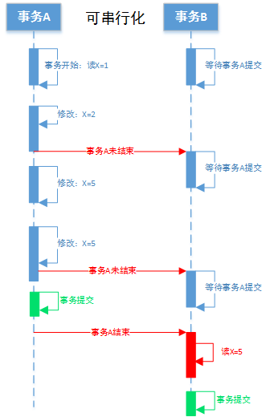

# MYSQL事务 - 隔离级别

## 事务是什么：    
    1. 一组SQL执行，要么全部成功，要么全部失败    
    2. 事务在存储引擎层面实现的
    3. 事务ACID特性    
        * 原子性 （ Atomicity ) ：一个事务不可分割
        * 一致性 （ Consistency )　： 从一种状态转到另一种状态
        * 隔离性 （ Isolation ） ： 事务提交之前，其他事务不可见
        * 持有性 （ Durability ) ： 一旦事务提交，更新保存数据库

## 隔离级别
    1. 读未提交 ( Read Uncommitted )
    2. 读已提交 ( Read Committed )
    3. 可重复读 ( Repeatable Read )
    4. 可串行化 ( Serializable )

## 隔离级别示意图

   
